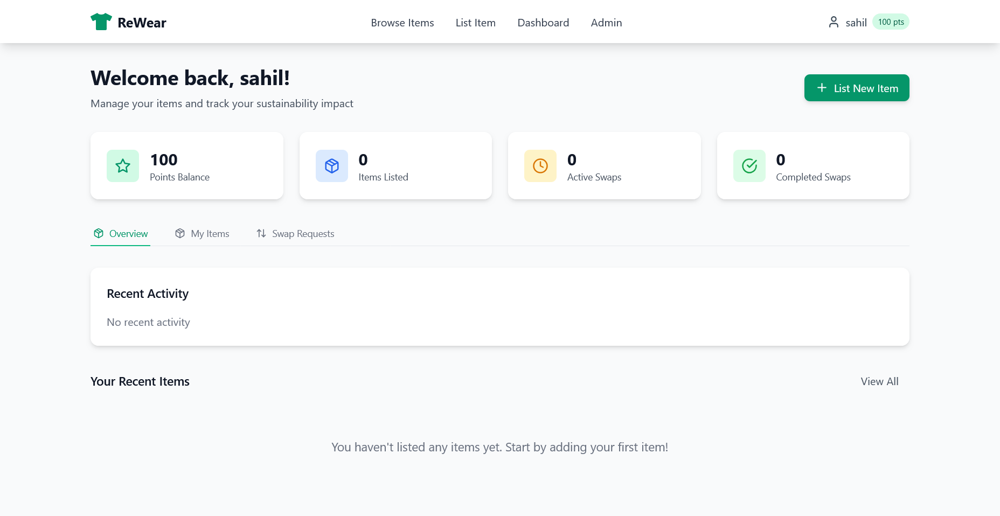

# ReWear – Community Clothing Exchange

ReWear is a web-based platform that enables users to exchange unused clothing through direct swaps or a point-based redemption system. The goal is to promote sustainable fashion and reduce textile waste by encouraging users to reuse wearable garments instead of discarding them.

## Features
- **User Authentication:** Email/password signup and login
- **Landing Page:** Platform introduction, CTAs, featured items
- **User Dashboard:** Profile details, points balance, uploaded items, ongoing and completed swaps
- **Swap Requests:** Users can send, accept, or reject swap requests. Recipients can accept swaps, which updates the status and points accordingly.
- **Points System:** Points are transferred between users for point-based swaps. Accepting a swap updates both users' balances.
- **Item Availability:** Once an item is swapped (completed), it is marked unavailable and removed from browse lists.
- **Item Detail Page:** Gallery, description, uploader info, swap/redeem options, and item availability status.
- **Add New Item:** Upload images, enter details, submit listing
- **Admin Panel:** Moderate, approve/reject, remove spam
- **Toast Notifications:** Global toast system for user feedback on actions (swap, item, etc.)
- **Loading Spinners:** Accessible spinners during async operations
- **User Avatars:** Profile avatar support with fallback
- **Accessibility:** ARIA attributes, keyboard navigation, and improved focus/hover states throughout UI

## FUNCTIONALITY

- Swap requests can now be accepted or rejected by item owners.
- Accepting a swap updates the item's availability and user points.
- Swapped items are automatically removed from the browse page and marked unavailable.
- Added toast notifications for all major user actions (swap, add item, etc.).
- Improved loading feedback with spinners and skeleton loaders.
- User avatars and better accessibility throughout the app.
## Tech Stack
- React + TypeScript
- Vite
- Tailwind CSS
- React Router

## Screenshot of project

<p align="center">
  
</p>

<p align="center">
  
</p>

<p align="center">
  
</p>

##for more screenshot checkout my screenshot folder

## Local Development

1. **Install dependencies:**
   ```sh
   npm install
   ```
2. **Start the development server:**
   ```sh
   npm run dev
   ```
3. **Visit:**
   Open [http://localhost:5173](http://localhost:5173) in your browser.
The output will be in the `dist/` folder.

## Deployment
You can deploy the `dist/` folder to any static hosting provider (Netlify, Vercel, GitHub Pages, etc).

## Project Structure
- `src/pages/` — Page components (Dashboard, Home, Login, Signup, Admin, etc)
- `src/components/` — Reusable UI components
- `src/contexts/` — React Contexts for auth/app state
- `src/assets/` — Images and static assets

## Admin Access
- Only users with `isAdmin` set to `true` can access the Admin Panel.

